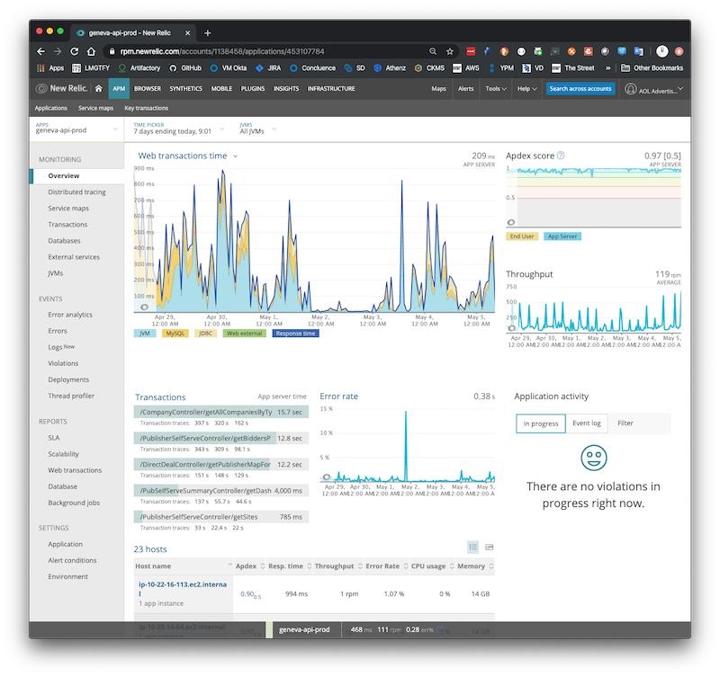
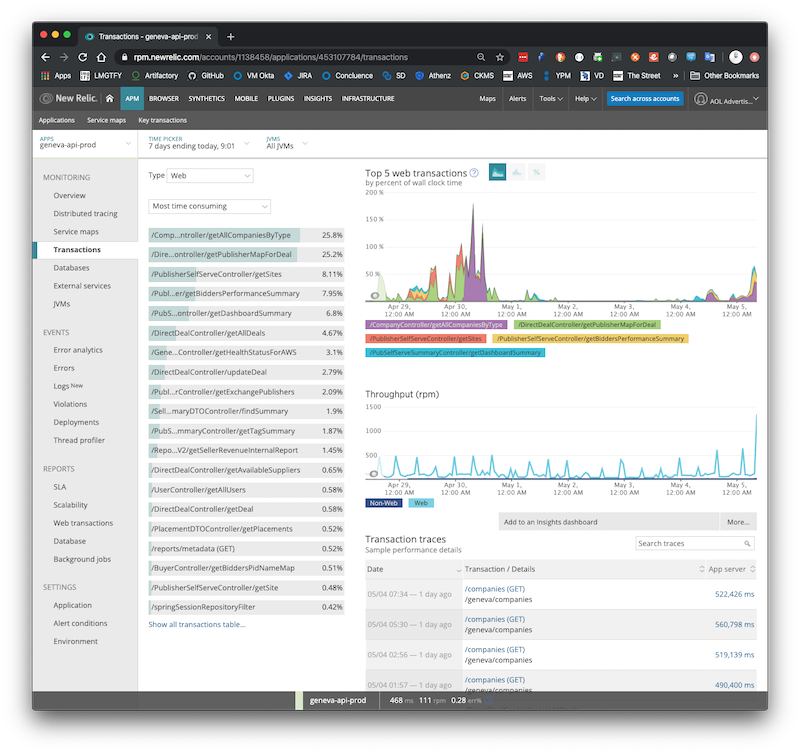
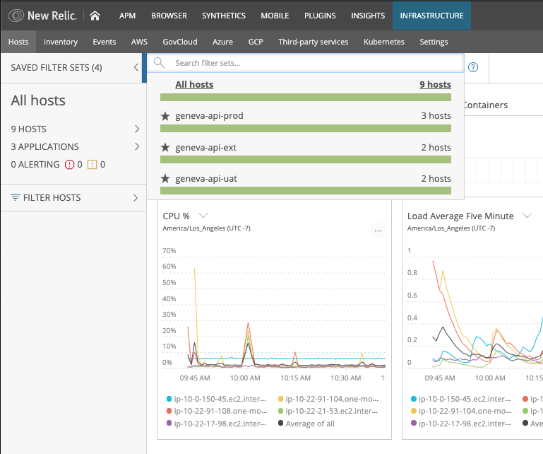
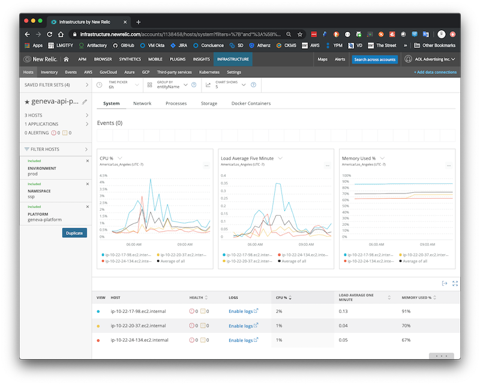

# APM: Application Performance Management

## Information


> In the fields of information technology and systems management, application performance management (APM) is the monitoring and management of performance and availability of software applications. 
> APM strives to detect and diagnose complex application performance problems to maintain an expected level of service[disambiguation needed]. 
> APM is "the translation of IT metrics into business meaning ([i.e.] value)..."

More information can be found at:

* [APM](https://en.wikipedia.org/wiki/Application_performance_management)

## APM: New Relic

Link: [http://yo/ssp-apm](http://yo/ssp-apm)

### Request Access

Please submit a ticket to [SSP PE](https://jira.vzbuilders.com/browse/SSPPE) specifying your: short-id, team and email.

### New Relic Java Agent

This agent provides JVM & application performance.

Available environments:

- geneva-api-uat
- geneva-api-ext
- geneva-api-prod
- geneva-ui-prod

#### Configuration

- Artifact type: `JAR` artifact
- License required: `true`

```shell script
.
├── playbooks
│   ├── ami.yml
│   └── instance.yml
└── roles
    └── geneva-server
        ├── tasks
        │   ├── ...
        │   ├── configure-newrelic.yml
        │   └── ...
        ├── templates
        │   ├── newrelic
        │   │   └── newrelic.yml.j2
        │   └── ...
        └── vars
            ├── ...
            └── newrelic.yml
```

#### Examples

**Application Overview**



**Application Transactions: Last 7 days**



### New Relic Infrastructure Agent

This agent provides dynamic monitoring of the entire infrastructure and its integration in cloud providers.

Available environments:

- geneva-api-uat
- geneva-api-ext
- geneva-api-prod

#### Configuration

- Artifact type: `YUM repo` package.
- License required: `true`

```shell script
.
├── playbooks
│   ├── ami.yml
│   └── instance.yml
└── roles
    └── geneva-server
        ├── tasks
        │   ├── ...
        │   ├── configure-newrelic-infra.yml
        │   ├── install-newrelic-infra.yml
        │   └── ...
        ├── templates
        │   ├── newrelic
        │   │   ├── newrelic-infra.repo.j2
        │   │   ├── newrelic-infra.yml.j2
        │   │   └── ...
        │   └── ...
        └── vars
            ├── newrelic-infra.yml
            └── ...
```

#### Examples

**Available Filters**



**Filter: geneva-api-prod**


