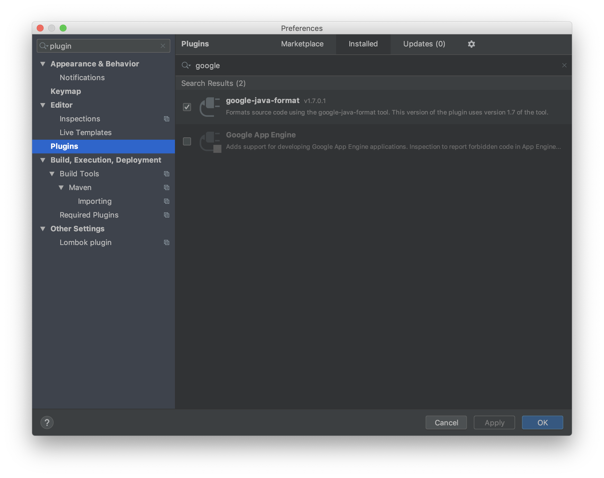
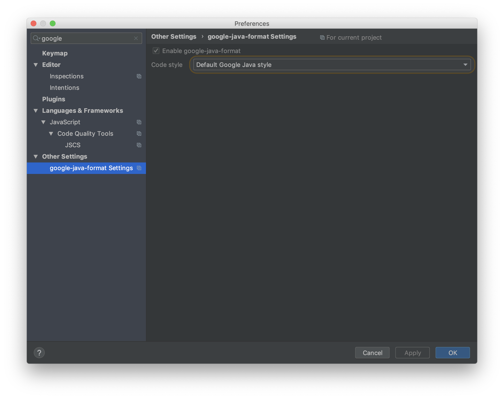
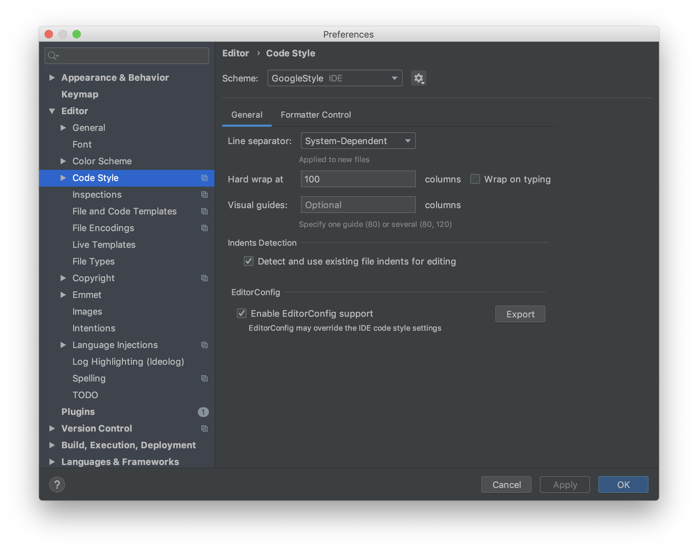
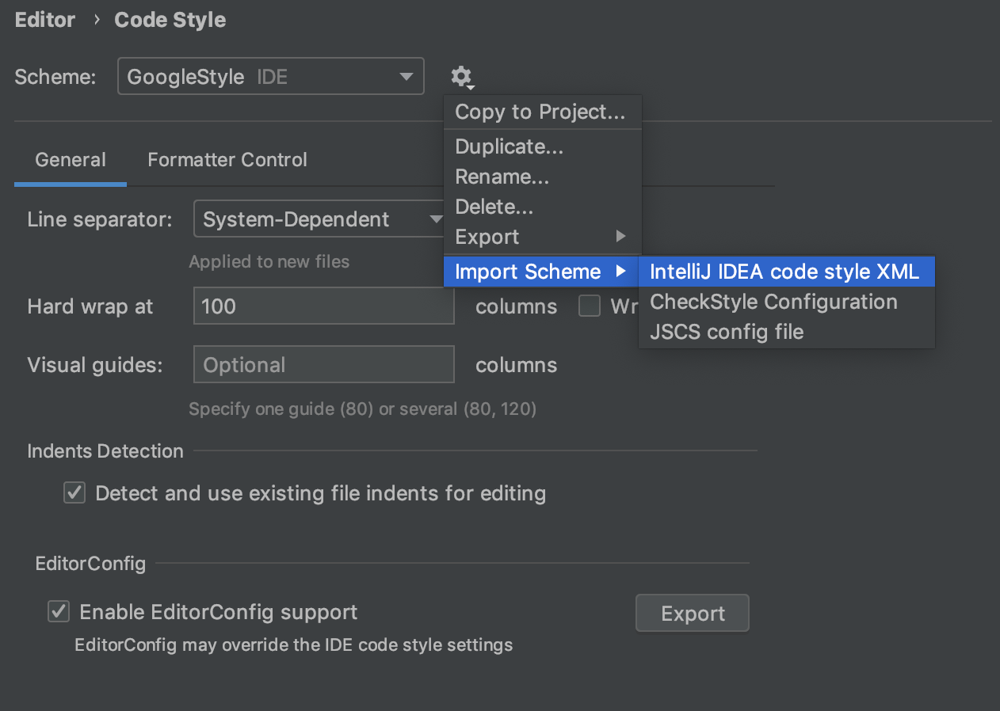

# Code Style

## Code Editor Configuration

Code Style is defined into `.editorconfig` file in the root directory. Please check your IDE available plugin in [here](https://editorconfig.org/#download).

More information [editorconfig.org](https://editorconfig.org)

## Maven

The following rules applies to the project:

* All dependencies/plugins versions have to be defined at parent pom level (geneva-api).
* No versions are defined at child level.
* Versions must be defined at `<properties>` section.
* Keep proper order for versions on properties (Internal, 3rd Party, Official...).
* Keep dependencies/plugins order consistency. 
* Use BOM versions if available.

> NOTE: test-acceptance is not a geneva artifact module. It only reuses some logic with parent pom, for consistency purposes.

## Java

- Code style for java is based on [Google Java Style Guide](http://yo/google-java).

### IDEs

Code Style automated configuration can be provided by plugin (recommended) or by style files. 

- IDE Plugins can be found at [google-java-format](https://github.com/google/google-java-format) repo.
- Style files: [Official Google Style Files](https://github.com/google/styleguide).

#### IntelliJ IDEA

##### Plugin (_Recommended_)

How-To: 

- `Preferences -> Plugins -> Marketplace`. 

- `Preferences -> Other Settings`. Be sure plugin is enabled at.

##### Style file

Source: `<ROOT>/.style/intellij-java-google-style.xml`.

How-To: 

- `Preferences -> Editor -> Code Style`. 

- Click on configuration icon and import the Style Setting file. 
- Select `GoogleStyle` as new coding style.

> NOTE: Due to a current [issue](https://github.com/google/google-java-format/issues/94), Intellij style file is also recommended to be installed to sort imports properly.

#### Eclipse IDE

##### Style file

Source: `<ROOT>/.style/eclipse-java-google-style.xml`.

How-To: 

- Under `Window/Preferences` select `Java/Code Style/Formatter`. 
- Import the settings file by selecting `Import`.

