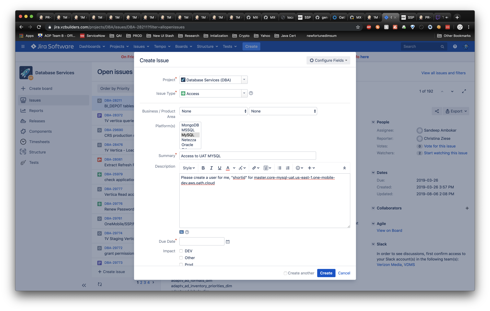
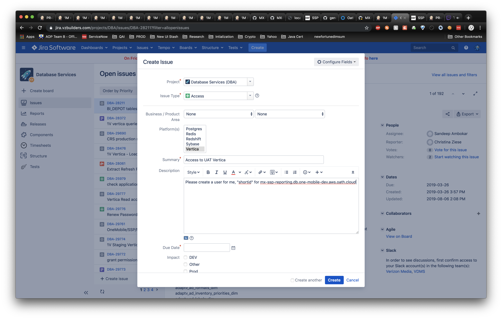
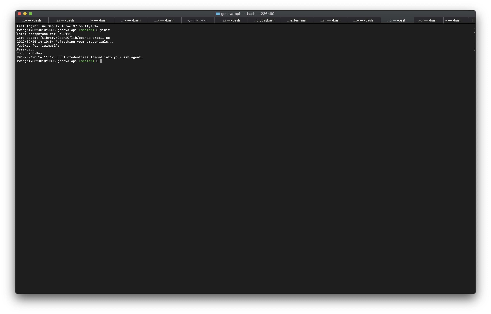

# Database Tunneling

## Requesting Access

In order to have access to the various databases in UAT you will need to first create a [JIRA ticket](https://jira.vzbuilders.com/projects/DBA/issues/DBA-28211?filter=allopenissues)





If you need to follow up on this ticket, please reach out to DBA Team:

DBA mail: [tech_us_dba_services@yahooinc.com](mailto:tech_us_dba_services@yahooinc.com)

## Yubikey

In order to DB tunnel make sure that your Yubikey is working correctly. Here is the link to the [Yubikey](https://thestreet.vzbuilders.com/thestreet/set-up-a-yubikey) documentation.

If your Yubikey is working correctly you should see the following series of prompts.



## Setting up the tunnel

After Yubikey activation, please run the command command associated to required data source.

### coredb

`uat`:

```  
export BASTION_HOST=tunnel.us-east-1.one-mobile-dev.aws.oath.cloud
export DBS_JUMPHOST=`host db-jumphost.db.one-mobile-dev.aws.oath.cloud | awk '{print $4}'`
export DB_HOST=uat.coredb.rw.us-east-1.one-mobile-dev.aws.oath.cloud
ssh -v -J ${BASTION_HOST}:2222 -g -L 3306:$DB_HOST:3306 $DBS_JUMPHOST
```

### dwdb

`uat`:

```
export BASTION_HOST=tunnel.us-east-1.one-mobile-dev.aws.oath.cloud
export DBS_JUMPHOST=`host db-jumphost.db.one-mobile-dev.aws.oath.cloud | awk '{print $4}'`
export DB_HOST=mx-ssp-reporting.db.one-mobile-dev.aws.oath.cloud
ssh -v -J ${BASTION_HOST}:2222 -g  -L 5434:$DB_HOST:5433 $DBS_JUMPHOST
```

> NOTE: Make sure that ports associated with theses commands have no processes running on them.

> NOTE: If you use `DBVisualizer` to access these DBs, make sure you have configured `TLS v1.2`. See instructions [here](TROUBLESHOOTING.md#troubleshooting-database-issues).

Then you will have access to the DB like it was on your local machine. Use the credentials that the DBA has provided to you.
