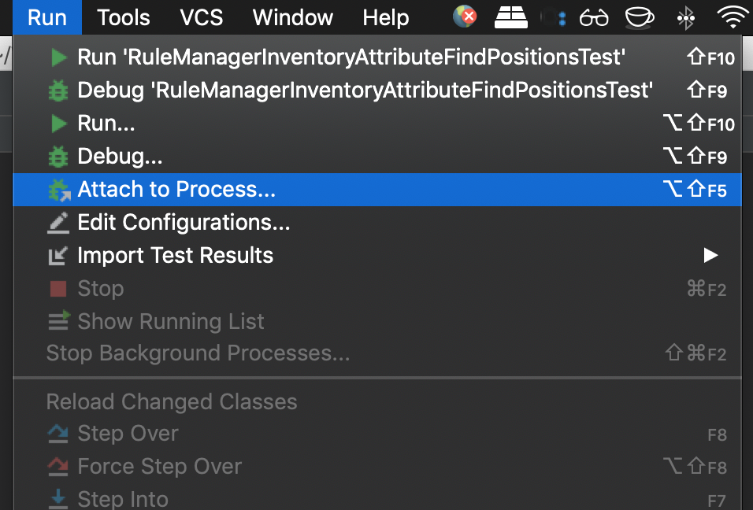
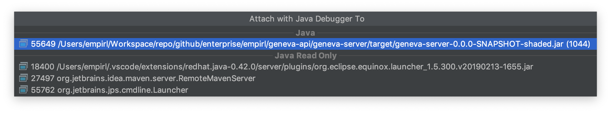
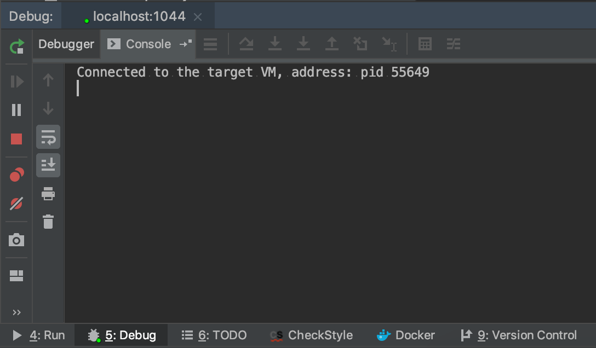
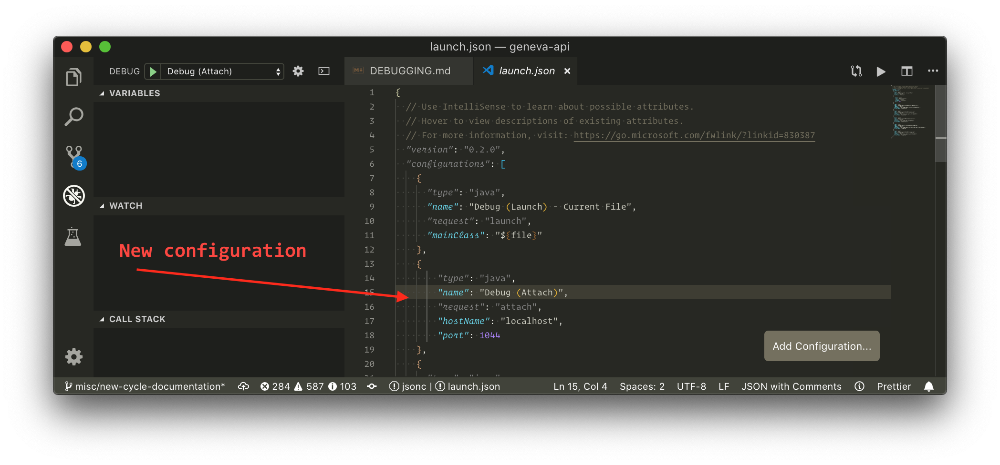
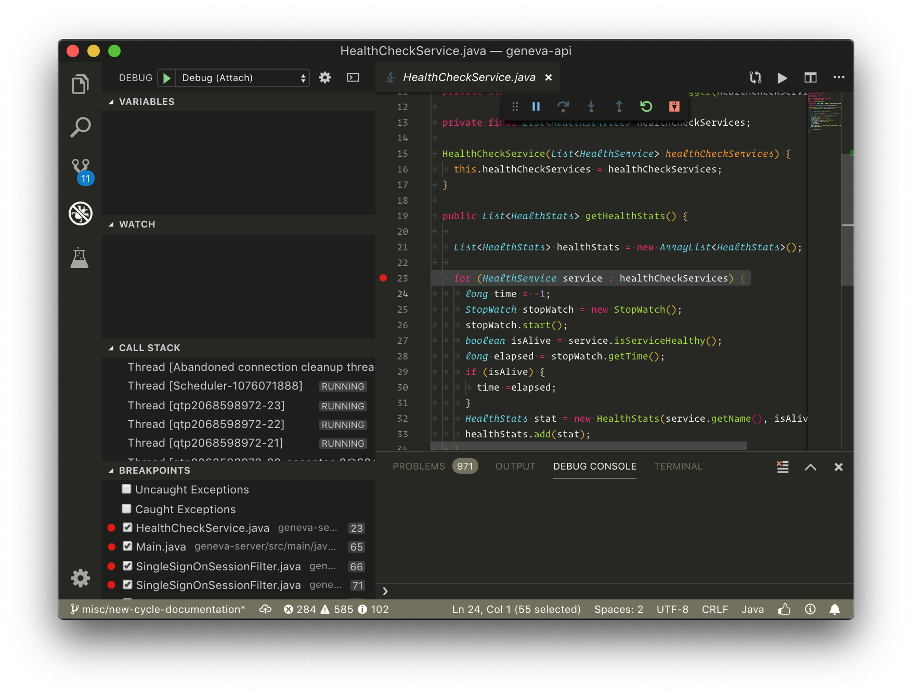

# Debugging

## Pre-requisites

To run the app please check the [Usage](USAGE.md) page.

## IDEs

### IntelliJ IDEA

It is necessary to add attach the code to the geneva-api running process.

Click on menu `Run > Attach to Process...`



Select `geneva-server-*.jar` running process at port *1044*.



Be sure the process gets attached.



### Visual Code

It is necessary to add an attach configuration to Visual Code. Configure your `.vscode/launch.json` to include the following piece of code.

```json
{
    "type": "java",
    "name": "Debug (Attach)",
    "request": "attach",
    "hostName": "localhost",
    "port": 1044
}
```



Select the new configuration and click in the _Start Debugging_ button.


