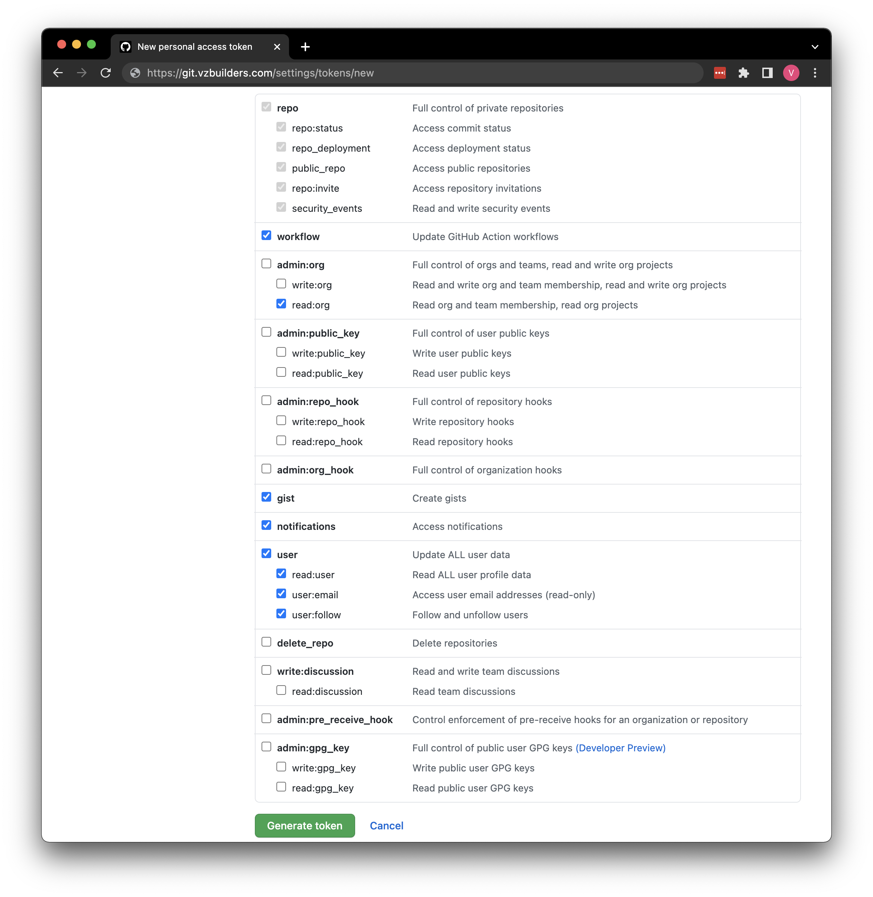
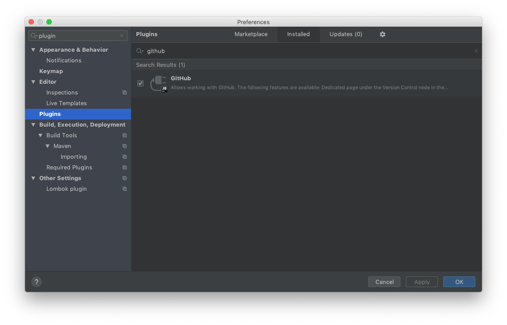
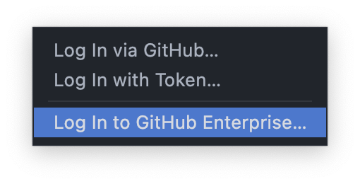
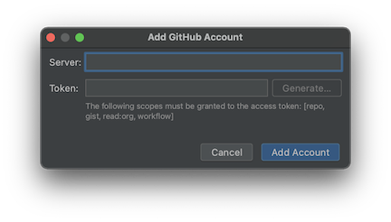
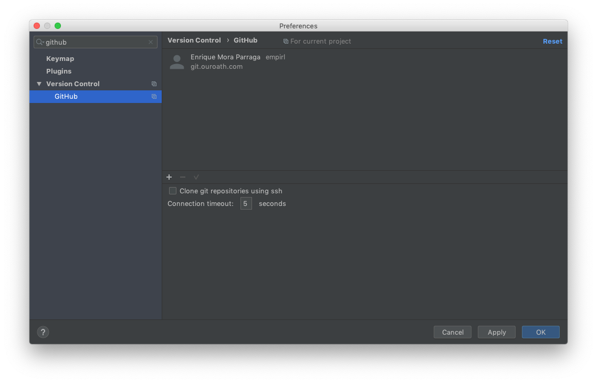
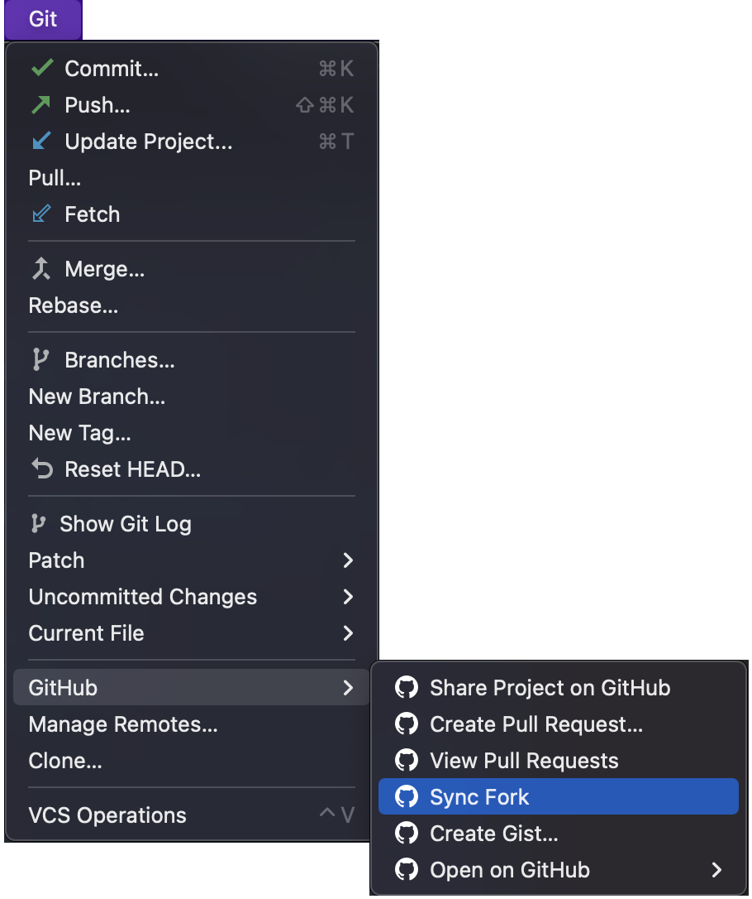

# Forking

The Pull Request strategy done for geneva-api uses forks for code reviews.
Please find more information at [Information](INFORMATION.md) page.

## Command line 

### How-to link to upstream repository

Define an _upstream_ repository pointing to the original one.

```bash
git remote add upstream git@git.ouryahoo.com:SSP/geneva-api.git
```

```bash
➜ git remote -v
origin  git@git.ouryahoo.com:<YOUR_USER>/geneva-api.git (fetch)
origin  git@git.ouryahoo.com:<YOUR_USER>/geneva-api.git (push)
upstream  git@git.ouryahoo.com:SSP/geneva-api.git (fetch)
upstream  git@git.ouryahoo.com:SSP/geneva-api.git (push)
```

### How-to keep your code updated

Fetch information from all repositories:

```bash
git fetch --all --tags --force
```

Pull information from all repositories:

```bash
git pull upstream  master
```

> NOTE: you can also rebase your branch with upstream commits.

## IDEs

It is required to obtain a developer token from GitHub. you can generate one at your personal profile.



Be sure you select the following sections:

- workflow
- admin:org
  - read:org 
- gist
- notifications
- user

### IntelliJ IDEA

Please install GitHub Plugin:



Select log in using GitHub Enterprise:



Log in using server (git.ouryahoo.com) & token:



Verify your user is logged in:



Now you can sync your fork using ```Sync Fork```:


