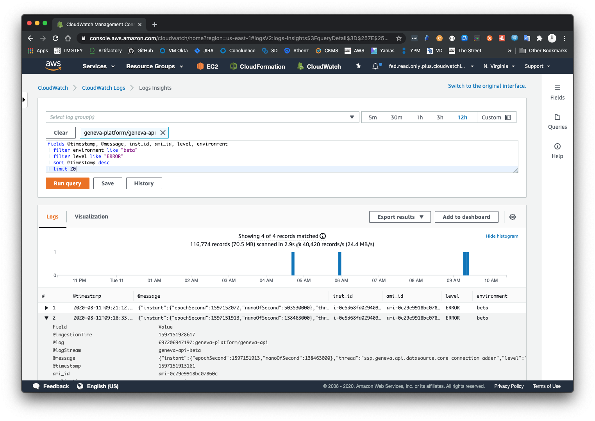
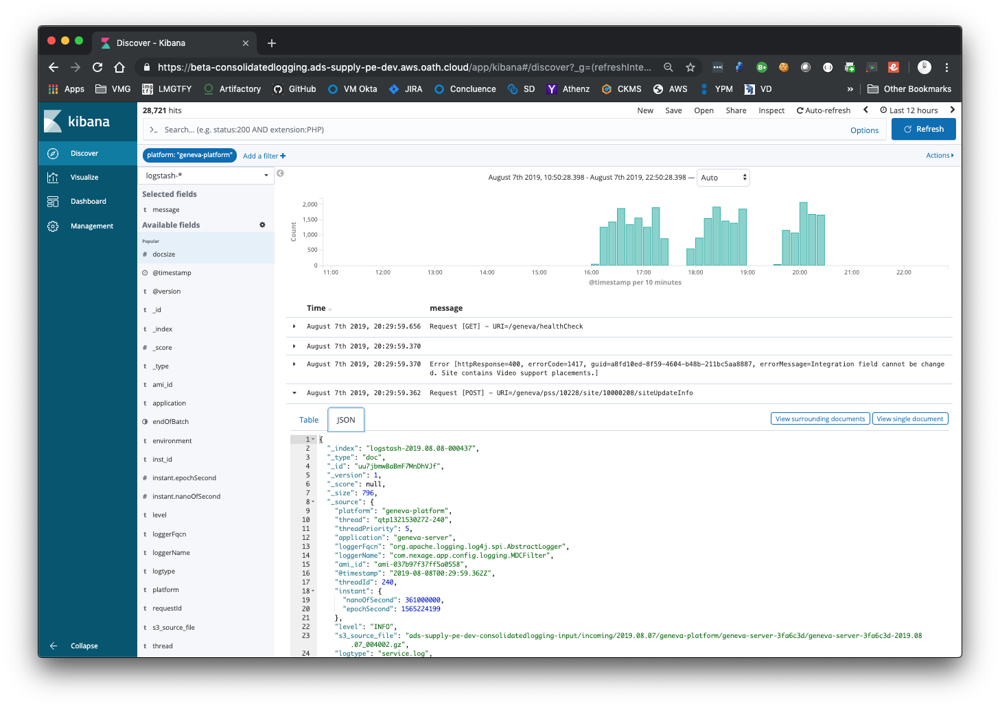
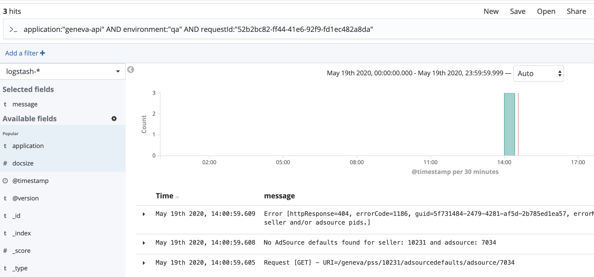

# Logging

Library: [Apache Log4j 2](https://logging.apache.org/log4j/2.x/)

## Types

### Local development

* Source: `src/conf/local/log4j2.xml`
* Layout: `PatternLayout`
* Format: `<Pattern>%-5p %d{yyyy-MM-dd HH:mm:ss} %c{1}:%L - [%m]%n</Pattern>`

Example:

```sh
WARN 2019-03-08 09:10:00 DeprecationWarning:43 - [Using @Deprecated Class com.nexage.app.config.SpringProfileListener]
```

### Pipeline

* Source: `cicd/ansible/roles/geneva-server/templates/log4j2.xml.j2`
* Layout: `Json`

Example:

```sh
{
    "thread": "main",
    "level": "ERROR",
    "loggerName": "org.hibernate.ejb.metamodel.MetadataContext",
    "message": "Illegal argument on static metamodel field injection : com.nexage.admin.core...",
    "endOfBatch": false,
    "loggerFqcn": "org.apache.logging.slf4j.Log4jLogger",
    "instant": { "epochSecond": 1552053286, "nanoOfSecond": 813000000 },
    "threadId": 1,
    "threadPriority": 5,
    "inst_id": "i-0994511a7dc2ca2c2",
    "ami_id": "ami-0dfb78cfe00e49845",
    "environment": "beta"
}
```

## Data Collector

* Agent: [fluentd](https://www.fluentd.org/)
* Description: Fluentd is an open source data collector for unified logging layer.
* Source: `cicd/ansible/roles/geneva-server/templates/fluentd-geneva-server.conf.j2`
* Destination: [CloudWatch::geneva-platform](https://console.aws.amazon.com/cloudwatch/home?region=us-east-1#logStream:group=geneva-platform/geneva-server)

### AWS CloudWatch

To facilitate developers to find information about logs, they are indexed into AWS CloudWatch.

* Official Documentation: [AWS CloudWatch](https://docs.aws.amazon.com/cloudwatch/index.html)

Making use of __AWS CloudWatch Insights__ we can find all logs indexed per environment and instance.

Example:

Return latest 20 errors for `beta` environment.

```
fields @timestamp, @message, inst_id, ami_id, level, environment
| filter environment like "beta"
| filter level like "ERROR"
| sort @timestamp desc
| limit 20
```



### Consolidated Logging

To facilitate developers to find information about logs, they are indexed into existing ELK stack. 

* one-mobile.dev: [http://yo/ssp-logs-beta](http://yo/ssp-logs-beta)
* one-mobile.prod: [http://yo/ssp-logs](http://yo/ssp-logs)



#### Querying

In order to search for log data related to Geneva API, it is required to set at least `application` and `environment` fields for filtering.

A simple query to get all log data for UAT environment would look like:

```ignorelang
application:"geneva-api" AND environment:"uat
```

To filter further down, additional fields can be added, for example log level or message string:

```ignorelang
application:"geneva-api" AND environment:"uat" AND level:ERROR AND message:"some message"
```

Complete reference for ELK query language can be found [here](https://www.elastic.co/guide/en/elasticsearch/reference/6.8/query-dsl.html)

#### Tracing requests

Geneva API logging framework tags each request with unique ID. This ID is applied to each log entry related to processing incoming request. Using this information, it is possible trace complete flow of the request in the logs.

A sample query leveraging request ID and it's output:

```ignorelang
application:"geneva-api" AND environment:"qa" AND requestId:"52b2bc82-ff44-41e6-92f9-fd1ec482a8da"
```



## Tweak Level

### Pipeline

Currently, there are some pre-defined Loggers ready to be tweaked:

- `com.nexage`: Global _geneva-api_ package.
- `com.nexage.dw.report`: _geneva-report_ module.
- `org.springframework`: Global Spring Framework package.
- `org.springframework.data`: _spring-data_ lib package.
- `org.springframework.security`:  _spring-security_ lib package.
- `org.hibernate`: Global ORM package.
- `org.hibernate.sql`: SQL package.

All those loggers can be overridden to change logs level following _Log4j2_ settings at pipeline level. 

Source: [geneva-server::ansible::variables](../cicd/ansible/roles/geneva-server/vars/main.yml)

* Update _AWS Parameter Store_ for the desired environment with the modified level.
* Use _AWS Autoscaling Group_ to take down and up one instance at a time. New instances will have changes in place.

> NOTE: Remember to roll-back change and repeat steps above again to avoid verbosity in logs and overload logs files into the instances. 
