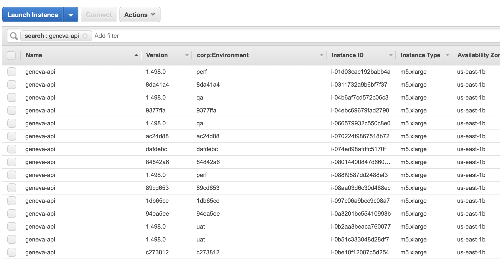
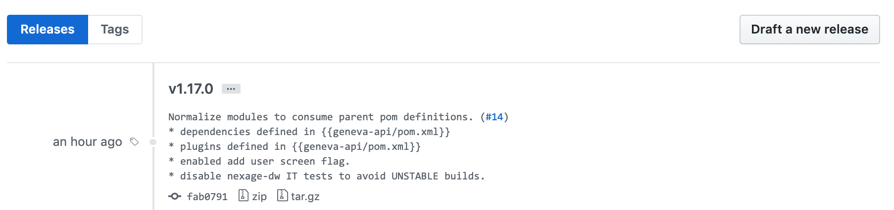

# Release

Every merge in master will deploy a production candidate. This can be tracked from the SD pipeline.
Pipeline automatically analyzes the expected version associated to a commit, depending on nature:

* Pull Request.
* Main branch (master).



## Pull Request versions.

Pull Requests use commit id as unique identifier. Example:

Stack:

```sh
geneva-api-02b8ae2
```

No tags are created for PRs.

## Master versions.

Master branch follows [Semantic Versioning 2.0.0](https://semver.org/). Example:

Stack:

```sh
geneva-api-1.22.333
```

Tags:

```sh
v1.22.333
```

At the end of the artifact construction, pipeline will tag the given commit with the new tag.



## Merge To Deploy

Geneva-API is a fully merge to deploy project. We control these releases by using the Release-Queue and exclude certain days. (Holidays/Weekends/Blackouts). Those dates can be found in this [configuration](https://git.ouryahoo.com/SSPTOPS/aws-infra-ads-one-mobile-prod/blob/master/configurations/release-queue-config.yaml).
We will be grouping releases when they get lined up in groups of five.  When they are released to production the release job will notify the developers in the slack channel #ssp-geneva-deploy.

For more information on the release queue please look at the following information.
* [Release-Queue](https://docs.google.com/document/d/1SFEsS88HRBlDMAXyugEn9WSxDuYJ2n0Qj4sGvyh9KsA/edit#heading=h.np67qw6ws6ju)
* [rq-cli](https://git.ouryahoo.com/ADTECH-CICD/rq-cli)

If there are any problems with the release to prod please ping the #ssp-geneva-deploy channel, both PE's and ssp-team-gsy are availible for support.

## Rollback

Usually in Geneva-API we roll forward, updating and then deploying a new version to fix a bug/defect.  If a rollback is necessary we will have the [release-management](https://git.ouryahoo.com/SSP/release-management) repo to deploy out the old version that was existing. Then we will revert the change that is breaking and will automatically deploy out the new version with the other changes that were non breaking from a master merge.

Please watch the channel #ssp-geneva-deploy if you should experience a failure with your deploy to our production environments. 

> Note: If the stack fails to update then the AWS-Cloudformation will automatically rollback to the previous version.
