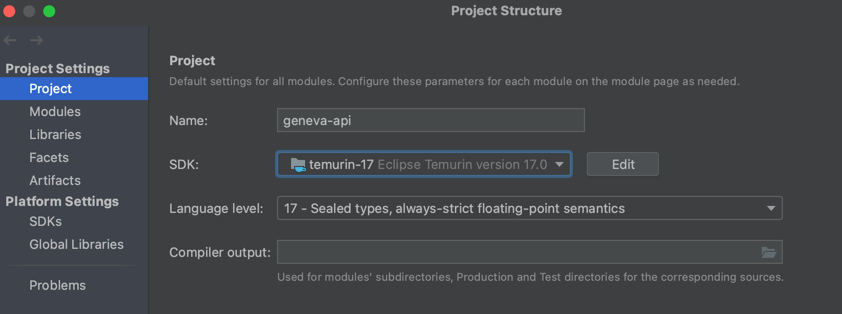

# Requirements

* Git 2.+
* Docker 20.+
* Java JDK 17.0.1+
* AWS CLI 1.11+

## IDEs

### IntelliJ IDEA

Click on menu `File > Project Structure...`



### Terminal

If you have multiple Java versions on your computer make sure that you are pointing to Java 17.

```shell script
➜ java -version
openjdk version "17.0.4.1" 2022-08-12
OpenJDK Runtime Environment Temurin-17.0.4.1+1 (build 17.0.4.1+1)
OpenJDK 64-Bit Server VM Temurin-17.0.4.1+1 (build 17.0.4.1+1, mixed mode, sharing)
```
