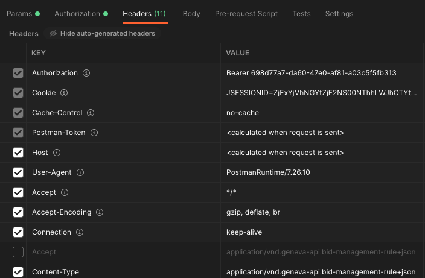
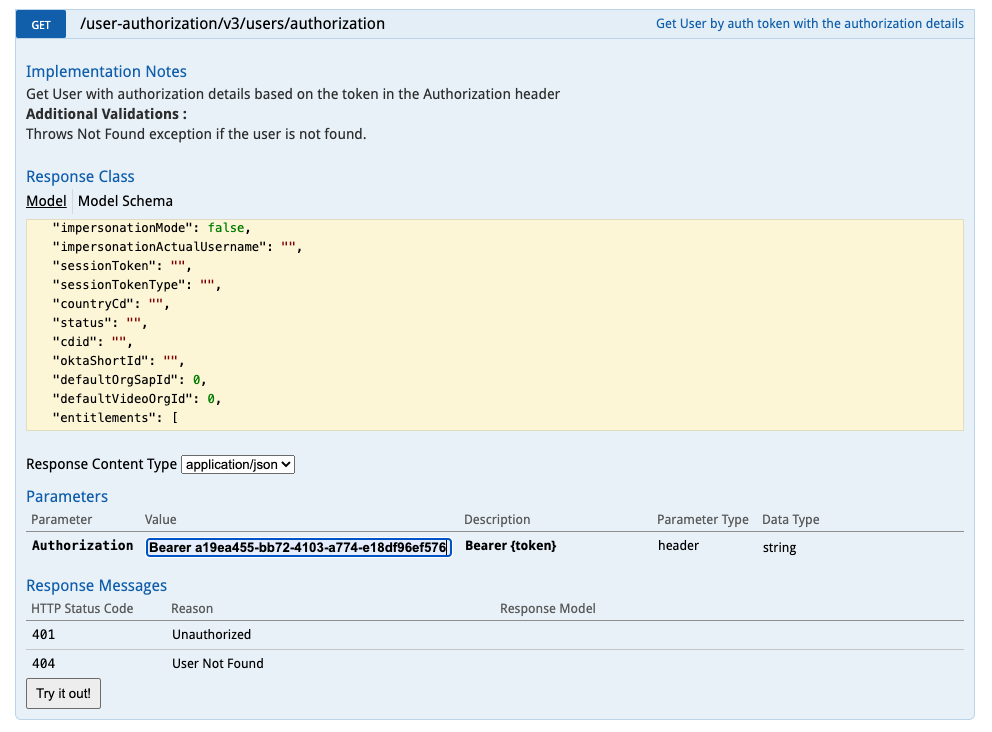

# Token Access

## How to generate Bearer Token

There are several ways to generate a token using Identity-b2b API:

* Via clientId and secret:

 > There's a guide on how to do it yourself [here](https://git.ouryahoo.com/pages/identityb2b/identityb2b-guide/oauth2/client-credentials/)
 > and a repo with a current working implementation in Java [here](https://git.ouryahoo.com/dgarciasantamar/bearer-token-generator)

You should get a token with this format:
```json
{"access_token":"698d77a7-da60-47e0-af81-a03c5f5fb313","scope":"one","token_type":"Bearer","expires_in":3599}
```
* Via refresh token 

> After succesfully logged in Geneva UI you can get an accces token based in your 
> current refresh token [here](https://uat.api.ssp.yahooinc.com/geneva/v1/tokens?qt=current&qf=true)
> 
>**NOTE:** the url is for UAT but is also available for PROD

you should get a token with this format:
```json
{
"content": [
{
"accessToken": "9399bed1-3399-4712-9ba6-a4701dec4c27",
"tokenType": "Bearer",
"expiresIn": 3599
}
],
"pageable": "INSTANCE",
"last": true,
"totalPages": 1,
"totalElements": 1,
"sort": {
"sorted": false,
"unsorted": true,
"empty": true
},
"first": true,
"number": 0,
"numberOfElements": 1,
"size": 1,
"empty": false
}
```

## How to access Geneva API using Bearer Token

Once you have a Bearer Token you can pass it to Geneva API as authorization header i.e via postman:



## How to retrieve your user/entitlements with your Bearer Token

Also you can use your token to verify your user/entitlements calliing OneCentral API [here](https://oneapi-qa.aol.com//one-central/doc/index.html)

**NOTE:** the url is for UAT but is also available for PROD


