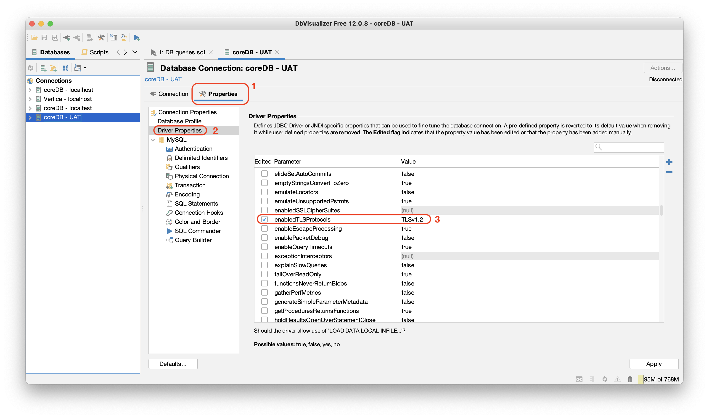

# Troubleshooting

> I cannot connect to MYSQL/VERTICA db.

Be sure both databases are up and running.

```sh
➜ docker ps
CONTAINER ID        IMAGE                                              COMMAND                  CREATED              STATUS              PORTS                                                                NAMES
8344d3e3ab3c        docker.ouroath.com:4443/ssp/dwdb:latest            "/docker-entrypoint.…"   About a minute ago   Up About a minute   0.0.0.0:5433->5433/tcp                                               dwdb
99aa93877363        docker.ouroath.com:4443/ssp/sso-mock:latest        "java -Djava.securit…"   20 minutes ago       Up 20 minutes       0.0.0.0:8090->8090/tcp                                               sso-mock
90483f2e8f17        docker.ouroath.com:4443/ssp/redis-cluster:latest   "/bin/sh -c /entrypo…"   20 minutes ago       Up 20 minutes       6379/tcp, 0.0.0.0:8380-8385->8380-8385/tcp                           redis-cluster
7dac81556343        docker.ouroath.com:4443/ssp/coredb:latest          "docker-entrypoint.s…"   20 minutes ago       Up 20 minutes       0.0.0.0:3306->3306/tcp                                               coredb
6a49119ffea7        localstack/localstack:0.8.7                        "/usr/bin/supervisor…"   20 minutes ago       Up 20 minutes       0.0.0.0:4567-4583->4567-4583/tcp, 8080/tcp, 0.0.0.0:7070->6060/tcp   localstack
```

You can check logs with the command `docker logs -f <CONTAINER_NAME>`.

Also be sure that minimum docker resources are allocated:

- CPUs: 4
- Memory: 4GB+


> My docker images are not properly working.

Our `make start` operation pulls latest docker images if available. As a last measure a whole docker cleaning operation can be done. Be aware this will remove all docker images/containers and all images will need to be downloaded again.

```sh
➜ docker system prune -a
WARNING! This will remove:
        - all stopped containers
        - all networks not used by at least one container
        - all images without at least one container associated to them
        - all build cache
Are you sure you want to continue? [y/N]
```

> Which user/pass is used in local development?

Right now the old hard coded user is available into the coredb. Please reach to the Team GSY for user/password.

> I cannot see my latest DB changes when I start up geneva-api

Geneva needs the latest version of golden data in order to see the most recent changes. In order to check this open the following two files (one for coreDB and one for Vertica DB):

```aidl
https://git.ouryahoo.com/SSP/docker-coredb/blob/master/data.version
https://git.ouryahoo.com/SSP/docker-dwdb/blob/master/data.version
```

The version in this file corresponds to the version of Golden Data. In order to see your latest changes open a PR for both repo (in order to keep everything in sync) with the updated Golden Data version. Also run a `make run` command on each repo to ensure that there are no errors.

> How can I check all beans creation to verify inter-dependencies?

Spring will create and manage all beans defined programmatically and through xml context. To check every overriding, creations and autowiring, enable the following logger into the application `log4j2.xml`.

```xml
<Logger name="org.springframework.beans.factory.support.DefaultListableBeanFactory" additivity="false" level="DEBUG">
  <AppenderRef ref="Console"/>
</Logger>
```

## Troubleshooting slow queries

Slow queries are logged in database without any context, which means it is difficult to find out which request generated the query. In order to explore this, Hibernate is configured to log slow queries. Currently, 
threshold is set to 500ms, so all queries that take longer than that to execute will be logged.

This, couple with unique request ID, allows us to correlate DB queries with requests that invoked them. It allows for easier debugging and troubleshooting.

Slow logs can be found in Kibana dashboard. The image bellow shows sample query to find slow logs for a given environment:


Each request has unique ID attached to it. It can be found under `requestId` field. Using this field, we can find the request endpoint which invoked the query:


This way, it is possible to narrow down all log messages that are correlated with given request ID and troubleshoot the query.

## Troubleshooting database issues

In order to add data to the database or look at the data that is already present you can set up a tool like DBVisualizer to interact with the docker image running both Vertica and MySQL.

Here are some screenshots of the configurations. The connection info can be found here [application.properties](https://git.ouryahoo.com/SSP/geneva-api/blob/master/geneva-server/src/test/resources/application.properties)


**IMPORTANT**: To be able to connect to Vertica and MySQL (`coreDB`) on UAT environment (using tunnel) with DBVisualizer, `TLS v1.2` must be configured. See the screenshot below for instructions:



## Public Key Retrieval is not allowed

When you have the native MySQL database running you can run into this specific error message when running the `make start` command.

```sh
01:07:13.023 [main] ERROR c.z.h.p.HikariPool [] [] - ssp.geneva.api.datasource.core - Exception during pool initialization.
java.sql.SQLNonTransientConnectionException: Public Key Retrieval is not allowed
```

Please make sure that only the `coredb` docker image is the only MySQL DB running on your machine.

## Troubleshooting Pipeline issues

#### PR Pipeline
Pipeline issues do happen. Here are the most common ones in the PR pipeline and how to fix them. Please remember to always check the logs and investigate yourself before contacting the #ssp-gsy-team channel. These first few unfortunately you will have to restart the pipeline.

> Stack with ID does not exist


> AMI Command Limit reached


```
11:59:32 channel 0: open failed: administratively prohibited: error creating forward connection, [538cb8878d] [error] target host none not found, Could not find the instance from aws
11:59:32 debug1: channel 0: free: client-session, nchannels 1
11:59:32 debug1: fd 0 clearing O_NONBLOCK
11:59:32 debug1: fd 1 clearing O_NONBLOCK
11:59:32 Transferred: sent 12468, received 7956 bytes, in 0.1 seconds
11:59:32 Bytes per second: sent 161159.8, received 102838.3
11:59:32 debug1: Exit status -1
11:59:32 lost connection
```
> This error occurs when you do not start the pipeline from the beginning, you cannot start the pipeline from a specific step. There is specific meta data that needs to be setup as well as the dependencies instance. Please start the pipeline always from the beginning.

If you run into a sso login failure on your cucumber tests you will have to restart as well.

> Artifactory Error 


If you experience this issue please contact the slack channel #artifactory for assistance.  

#### Master Pipeline
The Master pipeline updates many environments and there is a lot of debugging needed in order to sort out what the route cause of why some do not update correctly. Check the master [pipeline](https://screwdriver.ouroath.com/pipelines/1012581/events/) itself. This will give you a clue to where the issue is happening. There are some reoccurring problems things that happen in the master pipeline. Below are these outlined problems and how to debug and deal with them.

1. Flaky test in the mvn build. 
    * Run it again, if it fails again please create a ticket and a PR to disable said test and notify the developer that created it.
2. Failed UI Smoke Tests
    * Please look at the [UI SmokeTest](./TESTING-SMOKETESTS.md) for information on how to debug these tests.
    
3. SIGSEV Error
    * Sometimes an error occurs with the simple-deployment template, please restart the master pipeline if this occurs.
    
4. Cloudformation Stack failed to update
    * Often the Cloudformation stack fails to update, this can be caused by many things
        * Property missing in the SSM parameter store
        * Some AWS hiccups that cause the update to take longer than the alloted 10 minutes.
        * A primary dependency having issues (CoreDB, RedisCluster)
    * Check SD Logs for that deploy step
    
    * Check the Cloudwatch logs for any startup errors.
        * Any bean initialization errors should appear in those cloudwatch logs.
        * Login to [AWS](http://yo/aws-sso) and navigate to the [cloudwatch logs](https://console.aws.amazon.com/cloudwatch/home?region=us-east-1#logsV2:log-groups/log-group/geneva-platform$252Fgeneva-api).
        * Search for any errors that could have caused the failed update.
4. Contact GSY
    * If you have exhausted all of these steps then please contact #ssp-team-gsy. We will ask you if you checked all these steps before assistance.
