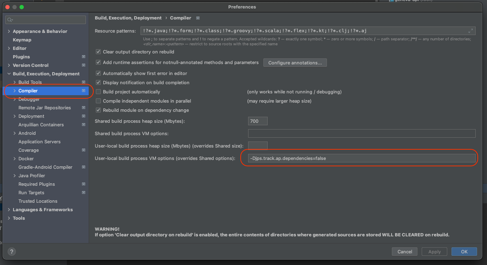

# Usage

## Local development

### Dependencies

Please check the [Requirements](REQUIREMENTS.md) page.

### Pre-configuration

Before running any `make` command, be sure you configure the app:

```bash
./configure
```

This operation only has to happen once.

### Local Execution

By default geneva-api runs on port _8080_.

Once the app is up and running you can visit [http://localhost:8080/geneva/login](http://localhost:8080/geneva/login).

once user login to above url endpoint then geneva ui can be access at http://localhost:9001

#### Terminal

Recommended way. To start/stop geneva in your local.

**Start**:

```bash
make start
```
**Start application without running tests**:
```bash
make start-quick
```

**Stop**:

```bash
make stop
```

#### IDE

If your IDE has execution capabilities you can run the app through it. This is not the recommended way, because it is IDE dependent.

Create a java execution in your IDE with the parameters below, remember to update the `<PROJECT ABSOLUTE PATH>` with the absolute path to this project.

```bash
-Dspring.config.location=<PROJECT ABSOLUTE PATH>/src/conf/local/application.properties \
-Dgeneva.features=<PROJECT ABSOLUTE PATH>/src/conf/local/FeatureVisibility.json \
-Dlog4j.configurationFile=<PROJECT ABSOLUTE PATH>/src/conf/local/log4j2.xml \
-Dspring.profiles.active=aws,uncompress,redis-local \
-Dport=8080 \ 
```

**Maven**: Soon we will be able to hook our maven build process with the docker-compose for more accurate integration tests.

**Lombok vs Intellij**: The Jetbrains IntelliJ IDEA editor is compatible with lombok without a plugin as of version 2020.3 
(no need to install lombok plugin, it comes bundled)
```
For versions prior to 2020.3, you can add the Lombok IntelliJ plugin to add lombok support for IntelliJ:

Go to File > Settings > Plugins
Click on Browse repositories...
Search for Lombok Plugin
Click on Install plugin
Restart IntelliJ IDEA
```
More information: https://projectlombok.org/setup/intellij

If you want to use lombok plugin, recommended Intellij version is `2020.2.2` or lower 
(`2019.3.5` intellij version and `1.18.18` lombok maven dependency works fine).

If you want to use Intellij with bundled lombok plugin (version `2020.3.1` or higher),
you may encounter intellij errors when running unit tests or building the project (from intellij).
However, when building the project with maven from terminal or dedicated maven plugin from intellij,
the build succeeds. A fix for this is to update the lombok maven dependency version to `1.18.20`.
(`2021.1` intellij version and `1.18.20` lombok maven dependency works fine) along with the compiler 
setting described here: 
https://stackoverflow.com/questions/65095215/lombok-not-working-with-intellij-2020-3-community-edition/65109376#65109376

```
To summarize go to IntelliJ Preferences (Cmd + ,)

Preferences ->  Build, Execution, Deployment -> Compiler

search for this option:

User-local build process VM options (overrides Shared options):

and add this value:

-Djps.track.ap.dependencies=false
```




Don't forget to run a `maven clean install` (either from terminal or from intellij plugin) if you get something similar: 
```
java: Bad service configuration file, or exception thrown while constructing Processor object: javax.annotation.processing.Processor: Provider com.ssp.geneva.common.base.annotation.processor.IncubatingProcessor not found
```

### Properties

Regardless of if a property needs to be added, removed or amended they always have to be defined (removed, or amended)
in the default file. For example: `cicd/ansible/roles/geneva-server/templates/application.properties.j2`

1.  If the property is **environment independent** it can directly be defined and filled in the above file without Ansible placeholder
2.  If the property is **environment dependent** the Ansible placeholder (defined in the default file) needs to be filled in the appropriate environment file:
    `cicd/ansible/roles/geneva-server/vars/geneva-{ENV}.yml`
3.  If the property is dynamically generated during runtime the Ansible placeholder (defined in the default file) doesn't need to be defined anywhere.

During runtime this property will be injected on the fly.

For the last case, it is of course the responsibility of the developer to make sure the property is present
in SSM/CKMS, otherwise the property wont be added and Ansible will, on purpose, fail.

### Code Style Operations

Please check the [Code Style](CODESTYLE.md) page.

#### Terminal

**Check Code Style**: This will run an analysis on the maven project.

```bash
make style-check
```

**Apply Code Style**: This will format the maven project, following the code style rules.

```bash
make style-apply
```
