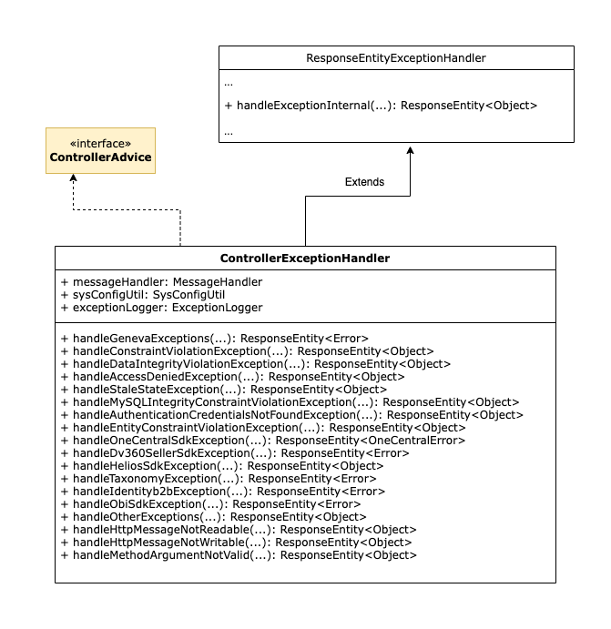

# How-To: Exceptions

This How-To explains some concepts related to Exceptions handling.

## Exception Handling

### Geneva Error Code
Geneva error code is designed in such a way that it is descriptive and holds maximum information required to identify the reason for any failure. [ErrorCode.java](../../geneva-common-error/src/main/java/com/ssp/geneva/common/error/model/ErrorCode.java) provides the interface for all the error codes.

### Geneva Error Code - Do's
* Make sure all the geneva-server-* module level error codes(enums) implement the interface [ErrorCode.java](../../geneva-common-error/src/main/java/com/ssp/geneva/common/error/model/ErrorCode.java)
* Every error code should have the prefix which denotes the module name (Eg: SECURITY_, SERVER_, COMMON_ etc.,) This helps to identify the modules easily on static imports as well as to identify the error code module easily from messages_*.properties.
* Make sure the error code is descriptive and avoid use of most common error messages like Bad Request, Internal Server Error etc.,
* Define the error code with appropriate HttpStatus code. Refer [HttpStatus](https://docs.spring.io/spring-framework/docs/current/javadoc-api/org/springframework/http/HttpStatus.html) and choose the HttpStatus that best suites your scenario.
* Make sure all the error codes are added with a proper descriptive message in messages_*.properties.
* Make sure the error codes are defined in order, and the same order is maintained in messages_*.properties in a categorised manner.

### Geneva Error Code - Dont's
* Do not add the dependency of geneva-common-error to any of the sdks(geneva-sdk-*) as they are meant to be independent.
* Do not create more than one ErrorCode enum per module.
* Do not create multiple error codes for the same failure scenario.

### Geneva Exception

[GenevaException.java](../../geneva-common-error/src/main/java/com/ssp/geneva/common/error/exception/GenevaException.java) stands as the base class for all custom exceptions that are created in geneva. Generic reusable exceptions are created in `geneva-common-error` module. 

### Geneva Exception - Do's
* Make use of generic custom exceptions defined in `geneva-common-error` wherever possible.
* In case of any need to create custom exception, it is recommended to get core approval during the design phase itself.
* Any new custom exception to be defined in geneva-server-* modules should extend [GenevaException](../../geneva-common-error/src/main/java/com/ssp/geneva/common/error/exception/GenevaException.java).

### Geneva Exception - Dont's
* Do not create multiple custom exceptions for the same purpose. 
* Do not create usecase wise custom exception. Instead, make the error code more specific.
* Do not catch and re-throw the same exception with the same/different error code.

### View Layer

Whenever an exception is thrown within our app there is a mechanism that captures it and translate it to a response to be sent to the consumer.

That mechanism is `ControllerExceptionHandler.java`. There are several methods for specific most common exceptions to handle results accordingly. 
If the exception does not have its own handler, the global method will treat it.

All exceptions are translated to a `ResponseEntity.java` same as successful api responses.

The following diagram shows a relationship of the handler.  

Last Update: `26/07/2022`

More information:

- [ControllerExceptionHandler.java](../../geneva-server/src/main/java/com/nexage/app/web/ControllerExceptionHandler.java)
- [ControllerAdvice.java](https://docs.spring.io/spring/docs/4.3.x/javadoc-api/index.html?org/springframework/web/bind/annotation/ControllerAdvice.html)
- [ResponseEntityExceptionHandler.java](https://docs.spring.io/spring/docs/4.3.x/javadoc-api/index.html?org/springframework/web/servlet/mvc/method/annotation/ResponseEntityExceptionHandler.html)
- [ResponseEntity.java](https://docs.spring.io/spring/docs/4.3.x/javadoc-api/index.html?org/springframework/http/ResponseEntity.html)
 
