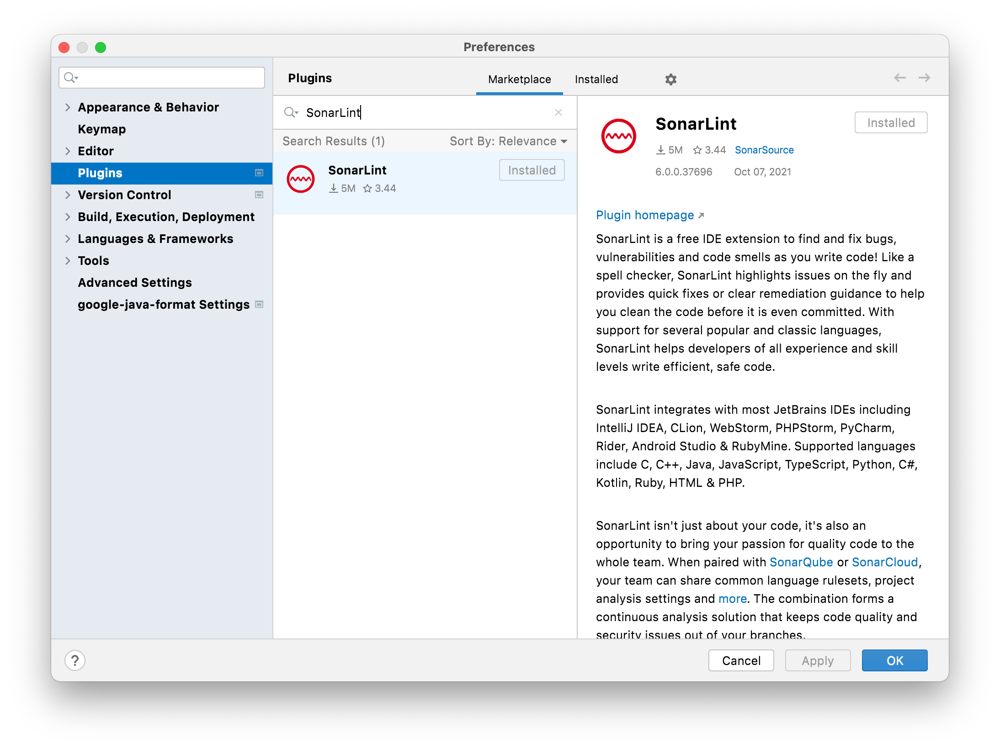
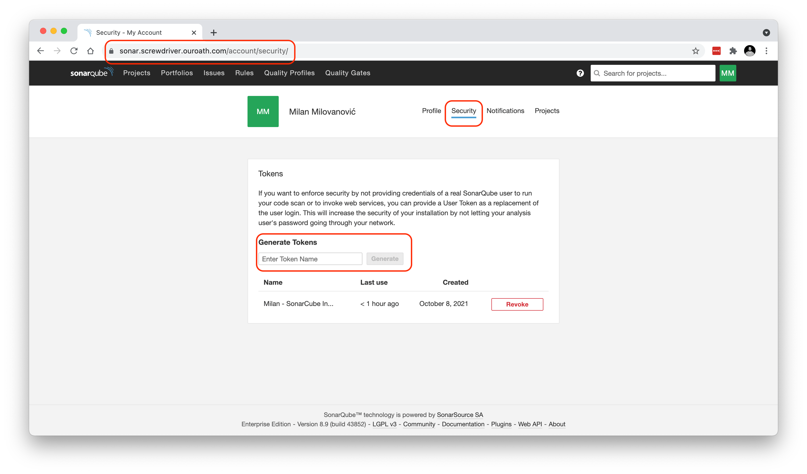
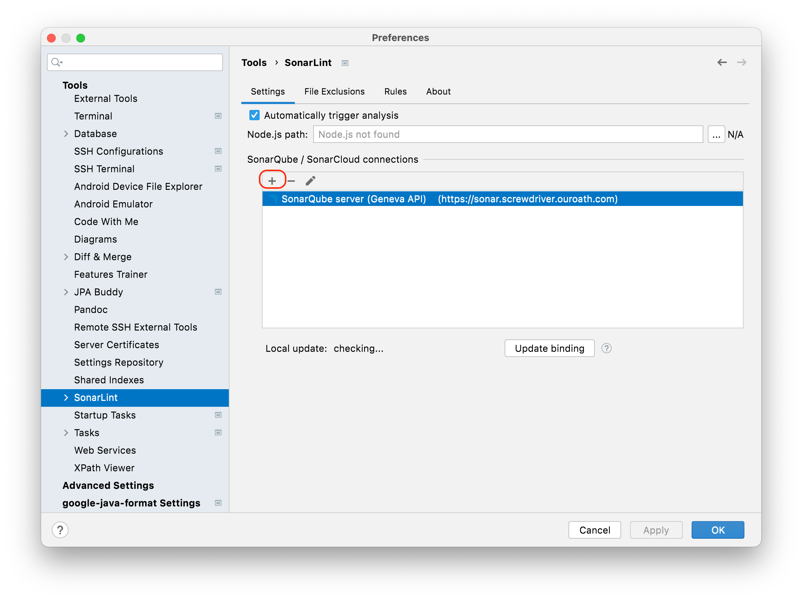
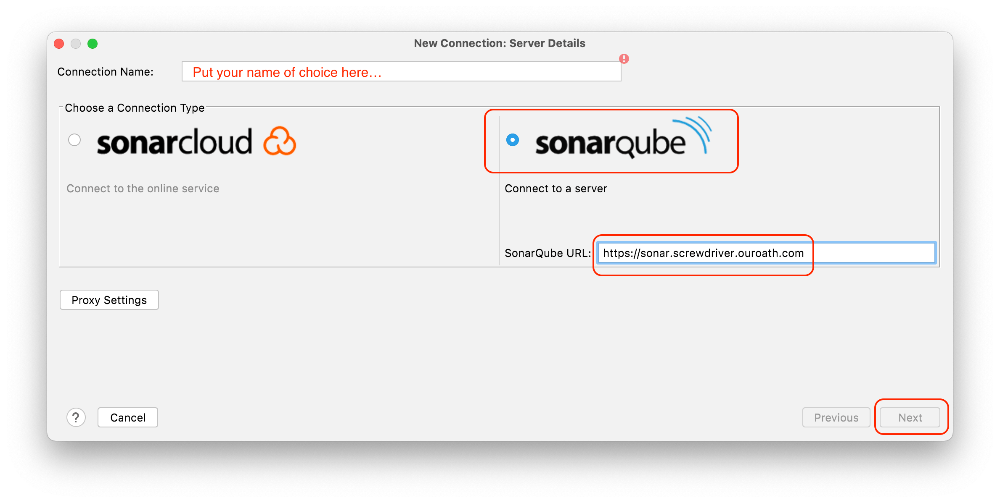
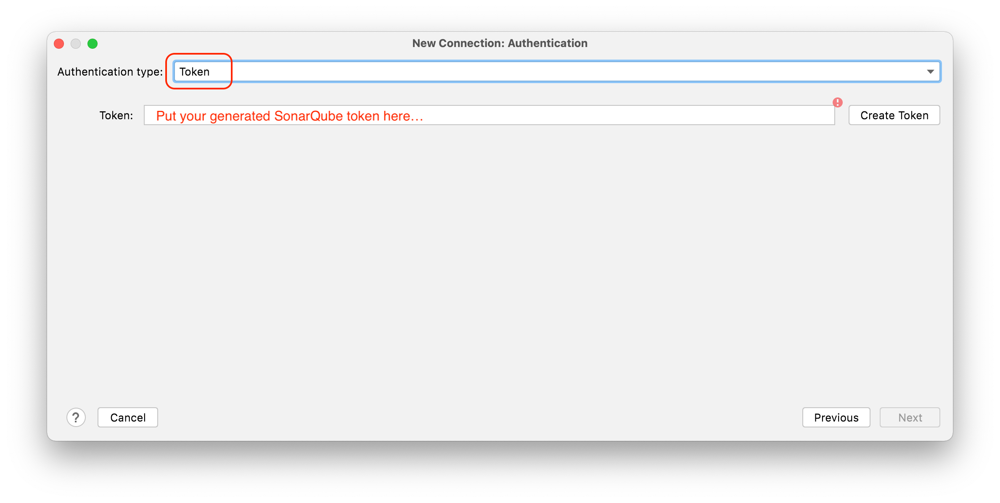
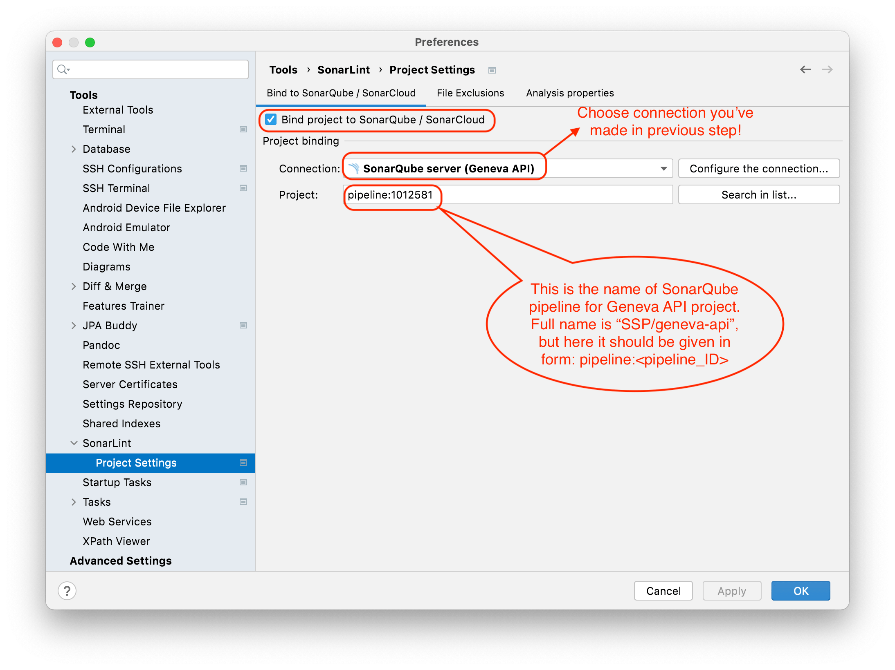

# SonarLint Plugin

SonarLint is IDE extension which helps fix quality and security issues in your code.
It's free and opensource and has support for all major IDEs (more details on: <https://www.sonarlint.org>)

By installing this plugin and connecting it to remote SonarQube server pipeline, that runs checks over Geneva API
code, developer can detect and fix all potential Sonar issues "on the fly" during local development,
following the same set of lint rules defined on remote server, thus speeding up the dev process.

## Setup SonarLint plugin for IntelliJ

* To **install** plugin go to: `Preferences -> Plugins -> Marketplace`.
Find `SonarLint`, install and restart your IDE.

* **Connect to remote SonarQube server**:
  1. Generate SonarQube authorization token, from your SonarQube profile page, and copy/save it for next step:
  
  
  2. To define connection to remote SonarQube server, open `Preferences -> Tools -> SonarLint` and press plus button
  under `SonarQube / SonarCloud connections` section. In connection wizard enter URL of SonarQube server
  (`https://sonar.screwdriver.ouroath.com`) and authorization token generated in previous step:
  
  
  

  3. Finally, after server connection is successfully created, you will be able to bind SonarLint to specific SonarQube
  project pipeline, using `Preferences -> Tools -> SonarLint -> Project Settings` section:
  
